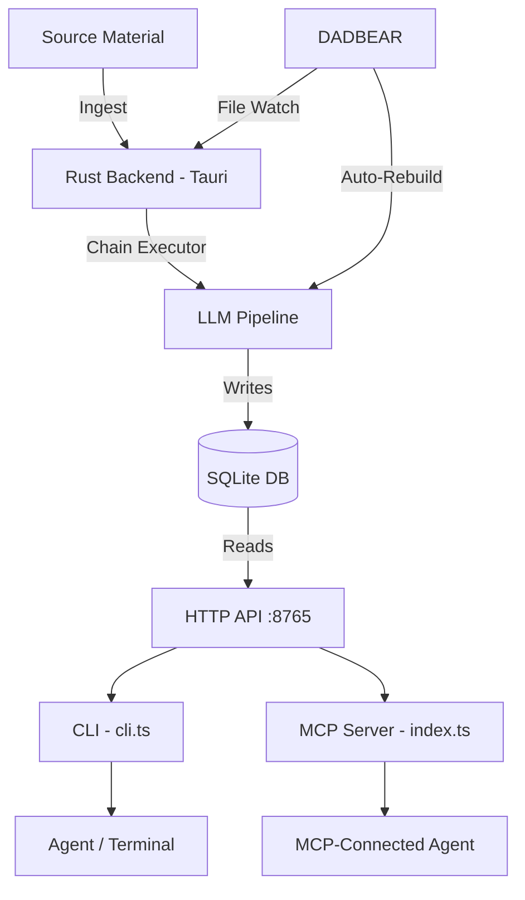

# Knowledge Pyramid System — Comprehensive Assessment

## What It Is (TL;DR)

The **Knowledge Pyramid** is an **LLM-powered codebase/document comprehension engine** built into the [Wire Node](file:///Users/adamlevine/AI%20Project%20Files/agent-wire-node) desktop application. It ingests source material (code repositories, document collections, or conversation logs), runs it through a multi-step LLM pipeline, and produces a **hierarchical knowledge structure** — a pyramid — with a single "apex" summary at the top and granular per-file analysis nodes at the base. The pyramid is then queryable by agents via a **CLI tool** and an **MCP server**, enabling any AI agent to understand a codebase without reading every file.

---

## Architecture Stack



| Layer | Technology | Role |
|-------|-----------|------|
| **Backend** | Rust (Tauri desktop app) | Chain execution, SQLite storage, HTTP API server on `localhost:8765` |
| **LLM Routing** | OpenRouter / local models | Multi-tier model selection (low/mid/high/max) |
| **Storage** | SQLite | All pyramid nodes, edges, annotations, FAQ entries, file hashes |
| **Chain Definitions** | YAML + Markdown prompts | Declarative pipeline configuration — *"All intelligence in YAML and prompts. Rust is a dumb execution engine."* |
| **Agent Interface** | TypeScript CLI + MCP Server | Dual access path for agents — CLI for terminal, MCP for tool-connected agents |

---

## The Build Pipeline

A pyramid build flows through these steps (using the `code` pipeline as the canonical example):

### 1. Ingestion (L0 Extraction)
Each source file is individually analyzed by an LLM, producing one **L0 node** per file. The node contains:
- `headline` — One-line summary
- `distilled` — Full narrative description
- `topics[]` — Named topics with `current` state, entities, corrections, decisions
- `self_prompt` — The question this node answers
- `terms[]`, `corrections[]`, `decisions[]`, `dead_ends[]`

**Key design**: L0 nodes are saved immediately (visible to queries before the build completes). Concurrency of 12, largest files first.

### 2. Cross-File Webbing
An LLM pass examines all L0 nodes and produces **web edges** — typed relationships between nodes with strength scores. These are the "cross-references" that show how files relate to each other.

### 3. Thread Clustering
L0 nodes are grouped into **threads** — semantic clusters representing coherent subsystems. Uses batched classification with field projection to handle large codebases (150 nodes per batch, 50K token limit). Multiple batches are merged into a unified thread set.

### 4. Thread Narrative Synthesis (L1)
Each thread gets synthesized into a single **L1 node** — a narrative summary of that cluster's purpose, responsibilities, and key patterns.

### 5. Recursive Upper Layers (L2, L3, ... Apex)
L1 nodes are recursively clustered and synthesized upward:
- The LLM decides whether the current set is "apex ready" via an `apex_ready` boolean signal
- If not, it produces clusters → synthesizes L2 nodes → re-evaluates
- This recurses until convergence (one apex node, or the LLM signals `apex_ready: true`)

**Convergence rule**: Each layer must have fewer groups than input nodes. No prescribed ranges.

### Result
A tree structure like:
```
L3 (Apex)         — 1 node: "What is this entire codebase?"
  L2               — 4-8 nodes: architectural domains
    L1             — 10-20 nodes: semantic threads  
      L0           — 30-200 nodes: per-file analysis
```

---

## Access Patterns

### CLI Commands ([cli.ts](file:///Users/adamlevine/AI%20Project%20Files/agent-wire-node/mcp-server/src/cli.ts))

| Command | What it does |
|---------|-------------|
| `apex <slug>` | Get the top-level summary — the "What is this?" answer |
| `search <slug> "query"` | Full-text search across all nodes, scored by relevance |
| `drill <slug> <node_id>` | Navigate into a node + its children (the "zoom in" operation) |
| `node <slug> <node_id>` | Get a single node without children |
| `faq <slug> "question"` | Match against accumulated FAQ entries |
| `faq-dir <slug>` | Browse the FAQ index |
| `annotations <slug>` | List agent-contributed annotations |
| `annotate <slug> <node_id> "content"` | Write back a finding (creates knowledge feedback loop) |

### MCP Tools ([index.ts](file:///Users/adamlevine/AI%20Project%20Files/agent-wire-node/mcp-server/src/index.ts))

The MCP server exposes 12 tools that mirror the CLI, usable by any MCP-connected agent:
`pyramid_health`, `pyramid_list_slugs`, `pyramid_apex`, `pyramid_search`, `pyramid_drill`, `pyramid_faq_match`, `pyramid_faq_directory`, `pyramid_annotate`, `pyramid_create_question_slug`, `pyramid_question_build`, `pyramid_composed_view`, `pyramid_references`

---

## DADBEAR — The Auto-Update Engine

**DADBEAR** = **D**etect, **A**ccumulate, **D**ebounce, **B**atch, **E**valuate, **A**ct, **R**ecurse

This is the live-update system that keeps pyramids fresh:

1. **Detect** — File watcher tracks SHA-256 hashes of source files
2. **Accumulate** — Changed files written to `pyramid_pending_mutations` WAL table
3. **Debounce** — Wait for activity to settle (configurable, default ~5 min)
4. **Batch** — Group mutations by layer
5. **Evaluate** — LLM stale-checks: "Given these file changes, is this L0 node still accurate?"
6. **Act** — Re-extract stale L0 nodes, re-synthesize affected parents
7. **Recurse** — Staleness propagates upward through the pyramid layers

Also includes a **runaway breaker** — if too many nodes go stale simultaneously, it trips rather than burning tokens.

---

## Question Pyramids

A secondary build mode that asks a **specific question** against one or more existing source pyramids:

1. Create a "question slug" referencing source slugs
2. The question is **decomposed** into sub-questions
3. Each sub-question is evaluated against source nodes (KEEP/DISCARD/MISSING verdicts)
4. Evidence sets are synthesized into answer nodes
5. Answers compose upward to a final answer apex

This is the `lens-0` concept in the handoff — it's designed to be a **question pyramid** asking some specific question about the underlying code pyramid.

---

## Vine (Conversation Pyramids)

A third pipeline for ingesting **conversation logs** (JSONL files from agent sessions):
- Each conversation session = one "bunch" (grape)
- Bunches are clustered temporally and topically
- Cross-session entity resolution and decision tracking
- ERA annotations for temporal phases
- Thread continuity analysis across sessions

---

## Annotation → FAQ Feedback Loop

The annotation system is the **agent contribution mechanism**:

1. An agent discovers something while using the pyramid
2. It writes an annotation with `--question` context
3. The backend processes the annotation into the **FAQ system**
4. Future agents querying `faq "similar question"` find the accumulated answer
5. The pyramid becomes smarter with each agent interaction

Annotation types: `observation`, `correction`, `question`, `friction`, `idea`

This is a **compound interest** design — every agent interaction deposits knowledge into the pyramid, making it more valuable for the next agent.

---

## The Handoff You Were Given

The handoff block you shared is a **pyramid access cheat sheet** designed to be pasted into an agent's context. It tells an agent:
1. How to explore the `lens-0` pyramid (apex → search → drill → faq)
2. How to contribute findings back (annotate)
3. DADBEAR status for the pyramid

The DADBEAR Status section showing `Auto-update: disabled`, `Last check: never` indicates this pyramid hasn't been set up for live updates — it's a static build.

---

## Friction Log

Here are the friction points I encountered during first-contact exploration:

### F1: `lens-0` Doesn't Exist Yet
> **Severity**: Blocker for handoff consumers
> 
> The handoff references `lens-0` as the target pyramid, but no slug with that name exists in the system. Running `apex lens-0` returns `{"error": "No apex node found"}`. The slug list shows `lens-0` was created at some point (it appears in [api-auth-route-debug-handoff.md](file:///Users/adamlevine/AI%20Project%20Files/agent-wire-node/docs/api-auth-route-debug-handoff.md)) but was originally created with `content_type: "document"` instead of `"question"`, and the build never completed.
> 
> **Impact**: Any agent receiving this handoff cannot do anything useful.

### F2: Error Message for Missing Pyramid is Ambiguous
> **Severity**: Medium
> 
> `{"error": "No apex node found"}` doesn't distinguish between "this slug doesn't exist" and "this slug exists but hasn't been built yet" and "this slug has L0 nodes but no apex yet." All three states return the same error.

### F3: No Way to Discover Available Pyramids from the Handoff
> **Severity**: Medium
> 
> The handoff only mentions `lens-0`. An agent receiving it has no instruction layout for checking what's actually available. The `slugs` command isn't referenced in the handoff template. A confused agent would need to know to run `slugs` independently.

### F4: DADBEAR Status Section Has Placeholder Values
> **Severity**: Low (cosmetic)
> 
> `Debounce: ? minutes` and `Last check: never` — these should either be populated from the actual config or omitted if DADBEAR isn't active.

### F5: CLI Examples Reference a Dead Slug
> **Severity**: Low
> 
> The CLI help text hardcodes example slug `agent-wire-nodepostdadbear` — this is a test artifact that may not exist on fresh installs. Not harmful, but confusing for discovery.

### F6: FAQ Returns Empty Without Explanation
> **Severity**: Low
> 
> `faq vibe-qp10 "How does authentication work?"` returns `{"matches": [], "message": "No FAQ entries matched your query."}`. This is reasonable, but the system doesn't tell the agent *why* there are no matches (no annotations have been contributed to this pyramid) or suggest the next step (try `search` instead, or contribute an annotation).

### F7: No Invocation for "Create the Pyramid if It Doesn't Exist"
> **Severity**: Medium
> 
> The handoff gives read commands but no create/build commands. If `lens-0` doesn't exist, the agent has no recovery path documented in the handoff.

### F8: Auth Token Resolution is Silent on Success
> **Severity**: Low
> 
> [lib.ts](file:///Users/adamlevine/AI%20Project%20Files/agent-wire-node/mcp-server/src/lib.ts) resolves auth from `PYRAMID_AUTH_TOKEN` env var or config file, but only logs on failure. A first-time user running `health` gets the JSON response with no indication of which auth path was used. Adding a `--verbose` flag or stderr note on auth resolution would help debugging.

---

## Summary Assessment

The Knowledge Pyramid is a **serious piece of infrastructure** — it's a local-first, LLM-powered codebase comprehension system with:

- **Declarative pipeline architecture** (YAML chains + markdown prompts, Rust as "dumb executor")
- **Multi-modal ingestion** (code, documents, conversations)
- **Live auto-update** (DADBEAR file watching + staleness cascade)
- **Agent feedback loop** (annotations → FAQ → compound knowledge)
- **Dual interface** (CLI for terminals, MCP for agent tool integration)
- **Question decomposition** (cross-pyramid knowledge composition)
- **7 distinct pipeline types** (code, document, conversation, vine, question, extract-only, document-v4-classified)

The design philosophy is that **agents shouldn't need to read raw source files** — they should navigate a pre-computed understanding web. The pyramid acts as a **compressed, queryable, self-updating summary** of an entire codebase, and it gets smarter as more agents interact with it.

The immediate blocker for the `lens-0` handoff is that the pyramid hasn't been built yet. Once it's created and built, the handoff template becomes a clean onboarding doc for any agent.
